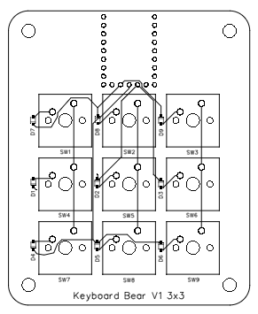
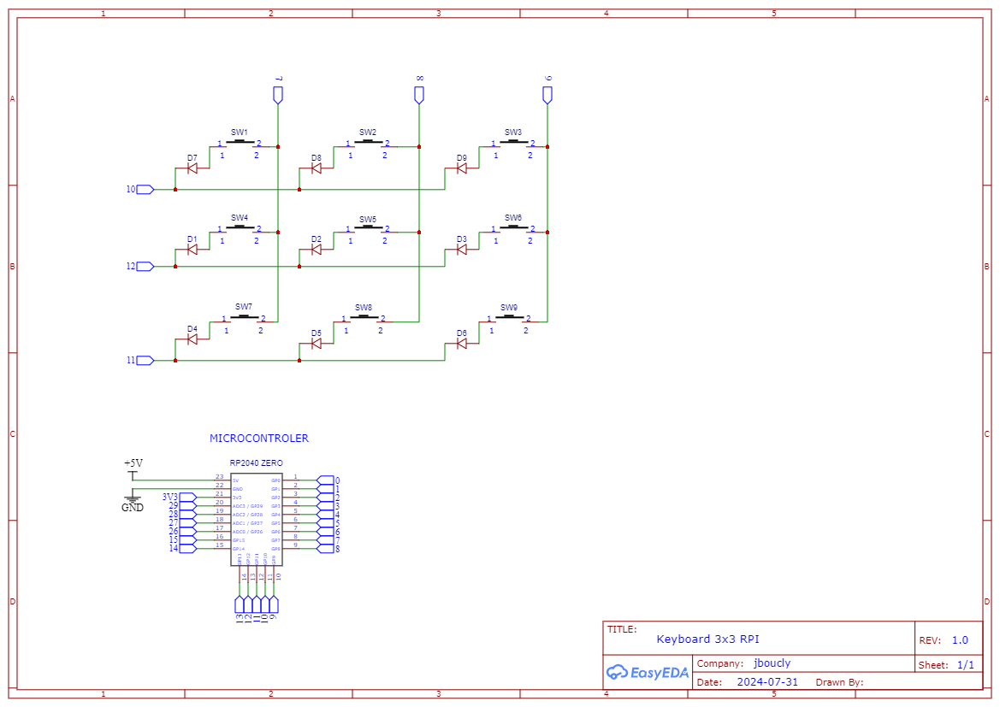
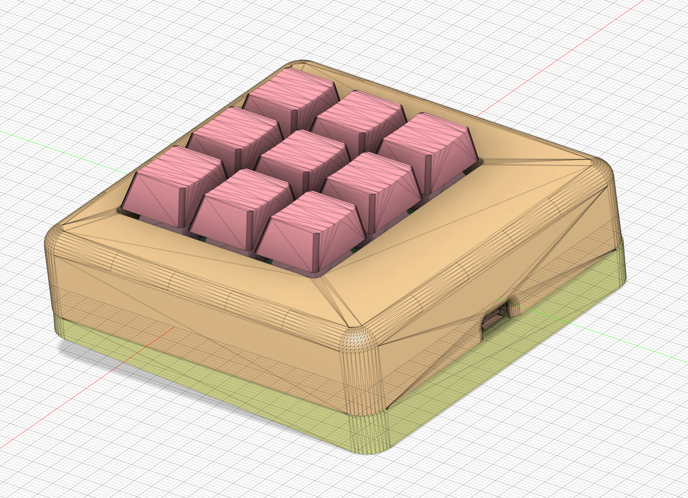

# Macropad 3x3

This is a 3x3 macropad. It is based on the RPI-2040-ZERO and uses a 3D printed case. It uses CircuitPython software with KMK for key and layout management.

Link to the 3D model : https://www.printables.com/fr/model/996658-macro-pad-3x3#preview:file-y6H6a

## Components

**Required : 3D printer**

| Nb  | Name             | Link                                                                                                                            |
| --- | ---------------- | ------------------------------------------------------------------------------------------------------------------------------- |
| 1   | RPI-2040 ZERO    | https://fr.aliexpress.com/item/1005005106645508.html?spm=a2g0o.order_list.order_list_main.4.710a5e5bx0oSne&gatewayAdapt=glo2fra |
| 9   | Switch MX Cherry | https://www.gloriousgaming.com/products/glorious-panda-mechanical-switches                                                      |
| 9   | Diode            | https://item.szlcsc.com/295156.html                                                                                             |
| 9   | Keycaps          | https://fr.aliexpress.com/item/32830177884.html?spm=a2g0o.order_list.order_list_main.10.710a5e5bx0oSne&gatewayAdapt=glo2fra     |
| 8   | M3 screws        | https://urlr.me/7tjgm                                                                                                           |
| 8   | M3 inserts       | https://urlr.me/7tjgm                                                                                                           |

## PCB

The PCB is designed with EasyEAD. You can find all file in the `pcb` folder. You can order it from JLCPCB with the `gerber.zip` file and for assembly you can use the `bom.csv` and `PickAndPlace.csv` file.

## Case

The case is designed with Fusion360. You can find all file in the `models` folder. You can print it with a 3D printer.

## Software

The software is based on CircuitPython and KMK. You can install KMK with [Pog](https://github.com/JanLunge/pog) !

If you want a tutorial on how to install KMK on the RPI-2040-ZERO, you can find it [here](https://youtu.be/758UmRS8oTs?t=1198)

## License

This project is under the Creative Commons Attribution-NonCommercial-ShareAlike 4.0 International (CC BY-NC-SA 4.0) license. You can find more information [here](https://creativecommons.org/licenses/by-nc-sa/4.0/).
